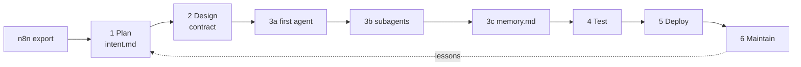

# Day 5 · From n8n to an agent on the Claude Agent SDK

**AetherLink training · Squad 1 · 17 September 2026 · tutorial**

You built a support-triage flow in n8n. In this tutorial you rebuild it as an
agent on the [**Claude Agent SDK**](https://github.com/anthropics/claude-agent-sdk-typescript)
— the agent loop behind Claude Code — **not by copying boxes, but by
translating them**: first into `intent.md`, then into a contract, then into
the four fundamentals every agent has:

> **system message · prompt · tools · memory** (here: a markdown file)

The only runtime dependency is `@anthropic-ai/claude-agent-sdk`. The setup
follows the official [Agent SDK quickstart](https://code.claude.com/docs/en/agent-sdk/quickstart).

## Lessons

Each lesson is one SDLC phase and has its own **solution branch**.

| Lesson | Phase | You build | Solution branch |
| --- | --- | --- | --- |
| [0 · Setup and the n8n source](lessons/0-source.md) | Source | project setup, read the export | `main` |
| [1 · Plan](lessons/1-plan.md) | Plan | `intent.md` translated from the n8n nodes | `step-1-plan` |
| [2 · Design](lessons/2-design.md) | Design | contract, JSON Schema, router — tests first | `step-2-design` |
| [3a · Your first agent](lessons/3a-first-agent.md) | Build | `query()` with `systemPrompt` + `prompt` | `step-3a-build-prompt` |
| [3b · Tools = subagents](lessons/3b-subagents.md) | Build | `Agent` tool + `options.agents` | `step-3b-build-tools` |
| [3c · Memory](lessons/3c-memory.md) | Build | `memory/<ticket_id>.md` | `step-3c-build-memory` |
| [4 · Test](lessons/4-test.md) | Test | scripted `query` streams, checker, human review | `step-4-test` |
| [5 · Deploy](lessons/5-deploy.md) | Deploy | CI, `.claude/agents/`, colleague handoff | `step-5-deploy` |
| [6 · Maintain](lessons/6-maintain.md) | Maintain | run log, team lessons | `step-6-maintain` |



## Quick start

## Workshop route

Open the [public Day 5 deck](https://aetherlink-training.ryanlisse.chatgpt.site/?squad=1&day=5#1)
and the [attendee route card](https://github.com/RyanLisse/aetherlink-agent-lab/blob/main/ATTENDEE-ROUTE.md)
before the session. The route card tells you which page is next and when to
clone this tutorial. Clone this repository once when the facilitator starts
the Claude Code translation; switch to the lesson branch named on the slide.
Do not download ZIPs, bundles, credentials or customer data.

```bash
git clone https://github.com/RyanLisse/aetherlink-day5-n8n-to-agent.git
cd aetherlink-day5-n8n-to-agent
git switch -c work/<your-name>        # your own branch, from main
npm install                            # Node 20+
claude                                 # do the lessons with Claude Code
```

Want to see the finished agent first?

```bash
git switch step-6-maintain && npm install
npm run verify                                            # typecheck + tests + checker
npm run triage -- fixtures/ticket.json --dry-run          # offline, no key
export ANTHROPIC_API_KEY=your-api-key
AGENT_MODEL=sonnet npm run triage -- fixtures/ticket.json --dry-run   # real run, ~20 s
```

## The four fundamentals, three places

| Fundamental | n8n node | `intent.md` | Claude Agent SDK |
| --- | --- | --- | --- |
| System message | AI Agent → System Message | Boundaries, stop rules | `options.systemPrompt` |
| Prompt | AI Agent → Prompt `{{ $json.… }}` | Input | `prompt` |
| Tools | Customer Reply Agent, Risk Agent | Success check 2 | `options.tools: ["Agent"]` + `options.agents` |
| Memory | Simple Memory (static keys) | Success check 7 | `memory/*.md` rendered into `prompt` |

```ts
for await (const message of query({
  prompt: `${buildTriagePrompt(ticket)}\n\n${renderMemory(memory)}`, // prompt + memory
  options: {
    systemPrompt: COORDINATOR_SYSTEM,                                  // system message
    tools: ["Agent"], allowedTools: ["Agent"],                         // tools …
    agents: createSpecialistAgents(),                                  // … = two subagents
    outputFormat: { type: "json_schema", schema: DECISION_SCHEMA },
    permissionMode: "dontAsk", settingSources: [],
    maxTurns: 8,                                                       // loop budget
  },
})) { /* stream → trace → validate → route → memory */ }
```

**You control the loop.** `maxTurns` decides how many turns the agent gets
before it must answer (n8n: *Max Iterations*); `result.num_turns` shows what
it used. Try `npm run triage -- fixtures/ticket.json --dry-run --max-turns 1`
and see it stop with `error_max_turns` ([Lesson 3a](lessons/3a-first-agent.md#control-the-loop-how-many-turns-before-an-answer),
[3b](lessons/3b-subagents.md#how-many-turns-does-it-take-now)).

Side by side in detail: [`docs/fundamentals.md`](docs/fundamentals.md) ·
node map: [`docs/design.md`](docs/design.md) · a real run:
[`docs/examples/live-run-wl-1026.json`](docs/examples/live-run-wl-1026.json).

Compare the build-up yourself:

```bash
git diff main..step-1-plan -- intent.md                       # n8n → intent
git diff step-2-design..step-3a-build-prompt -- src            # + systemPrompt & prompt
git diff step-3a-build-prompt..step-3b-build-tools -- src      # + subagents
git diff step-3b-build-tools..step-3c-build-memory -- src      # + memory
```

## Repository layout (solution branch)

```text
lessons/                    the tutorial, one file per lesson
n8n/support-triage.json     the source flow (sanitized export)
intent.md · progress.md     Plan + current state (imported by CLAUDE.md)
starter/                    TODO versions of every file you build
fixtures/                   WL-1026, WL-1027, adversarial, malformed tickets
src/contract.ts             types, DECISION_SCHEMA, ROUTES, checks   (Lesson 2)
src/router.ts               parse → validate → route                 (Lesson 2)
src/prompts.ts              system message + prompt                  (Lesson 3a)
src/runtime.ts              SDK query() or offline fake              (Lesson 3a, given)
src/cli.ts                  npm run triage                           (Lesson 3a, given)
src/tools.ts                two subagent definitions                 (Lesson 3b)
src/memory.ts               markdown memory                          (Lesson 3c)
src/agent.ts                the query() loop, all four fundamentals  (Lessons 3a–3c)
src/check.ts                checker CLI                              (Lesson 4)
test/                       node:test suites                         (Lessons 0–4)
memory/MEMORY.md            team lessons the agent reads             (Lesson 6)
.claude/agents/             the same subagents as Claude Code files  (Lesson 5)
```

Dependencies: `@anthropic-ai/claude-agent-sdk` at runtime; `tsx`,
`typescript` and `@types/node` for development. Tests use Node's built-in
`node:test`.

## Runtimes

| `AGENT_MODEL` | Needs | Use |
| --- | --- | --- |
| `offline` (default) | nothing | the whole room can run the loop; scripted, **not model evidence** |
| `sonnet`, `opus`, `haiku` or a full id like `claude-sonnet-5` | `ANTHROPIC_API_KEY` exported in your shell | real Claude Agent SDK run (a few cents); record it in `progress.md` |

The SDK reads the key from the environment and does not load `.env` files.

## Safety boundary

Fictional data only. Nothing is sent, refunded, escalated or written to n8n,
GitHub or a CRM. The coordinator may only use the `Agent` tool; the
subagents have no tools. Every result has `draft_only: true` and
`human_approval_required: true`; a checker PASS is never business approval.
Keys never go into files, prompts or commits.

## Related

- [Claude Agent SDK (TypeScript)](https://github.com/anthropics/claude-agent-sdk-typescript) · [quickstart](https://code.claude.com/docs/en/agent-sdk/quickstart)
- Trainer workbook: [aetherlink-training-template · day-5](https://github.com/RyanLisse/aetherlink-training-template/blob/main/days/day-5.md)
- Original participant guide: [aetherlink-agent-lab · support-triage](https://github.com/RyanLisse/aetherlink-agent-lab/blob/main/scenarios/support-triage/README.md)
