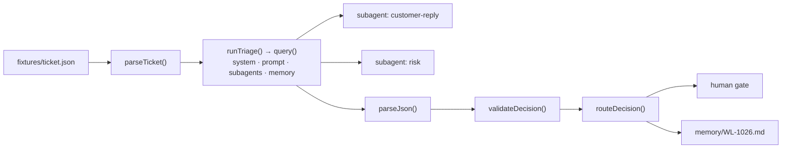

# Design — node → contract → code

Branch: `step-2-design`

## Data flow



## Node map

| n8n node | Contract / function | File | Change vs. n8n |
| --- | --- | --- | --- |
| When clicking 'Execute workflow' | `npm run triage` | `src/cli.ts` | local, reproducible command |
| Ticket Input | `Ticket` (strict) | `src/contract.ts` | unknown fields rejected |
| AI Agent (prompt + system) | `options.systemPrompt`, `prompt` | `src/prompts.ts` | rules moved to system; `ticket_id` added; `outputFormat` enforces JSON |
| OpenAI Chat Model (`gpt-5-mini`) | `resolveRuntime()` → `options.model` | `src/runtime.ts` | Claude Agent SDK `query()`; offline fake for class |
| Customer Reply Agent | subagent `customer-reply` via the `Agent` tool | `src/tools.ts` | exactly once, traced |
| Risk Agent | subagent `risk` via the `Agent` tool | `src/tools.ts` | output copied verbatim to `risk_note` |
| Simple Memory ×3 (keys 1/2/1) | `loadMemory` / `appendRun` | `src/memory.ts` | `memory/<ticket_id>.md` |
| Code in JavaScript | `parseJson` | `src/router.ts` | returns `Result`, never throws |
| (missing) | `validateDecision` | `src/router.ts` | contract + identity check |
| Switch | `ROUTES` + `routeDecision` | `src/contract.ts`, `src/router.ts` | lowercase, total mapping |
| Low/Medium/High Priority Action | `RoutedDraft` + `TEAMS` | `src/contract.ts` | always `draft_only`, `human_approval_required` |

## Contract

```ts
TriageDecision = {
  ticket_id: string            // must equal input
  priority: "low" | "medium" | "high"
  sentiment: "neutral" | "frustrated" | "angry"
  recommended_action: "auto_reply" | "investigate" | "escalate"  // = ROUTES[priority]
  summary: string
  customer_reply: string       // from subagent customer-reply, verbatim
  risk_note: string            // from subagent risk, verbatim
  draft_only: true
  human_approval_required: true
}
```

## Failure cases (each has a test)

SDK run not successful · malformed JSON · unknown priority · priority/action conflict · ticket_id
conflict · missing `risk_note` · a safety flag `false` · unknown field ·
uppercase n8n action · specialist missing or called twice · unknown tool.

## Decisions

- **Deterministic routing outside the model.** The model proposes a priority;
  code decides the action. A conflict is a failure, not a correction.
- **Preservation by construction.** Specialist outputs are copied from the
  tool trace, so the model cannot paraphrase the `risk_note` away.
- **A bounded loop.** The coordinator gets `maxTurns: 8` (2 needed in our
  runs) and each specialist `maxTurns: 2`. Running out of turns is a failure
  with a plain message, never a partial draft.
- **Memory as markdown, per ticket.** Readable, diffable, isolated; written
  only after a pass.
