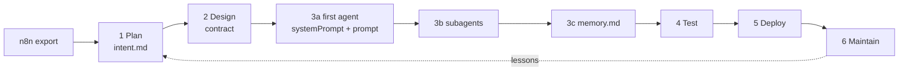

# Lesson 0 · Setup and the n8n source

> ⏱ 15 min · branch `main` · next: [Lesson 1 · Plan](1-plan.md)

You built a support-triage flow in n8n. In this course you rebuild it as an
agent on the **Claude Agent SDK** — the same agent loop that powers Claude
Code, callable from TypeScript. You won't copy boxes: you'll **translate**
them, first into `intent.md`, then into a contract, then into the four
fundamentals every agent has.

**What you'll do:**

1. Set up the project with the Agent SDK
2. Read the n8n export and name what it forgets
3. Run the source tests that pin those gaps down

## Prerequisites

- **Node.js 20+** and git
- An **Anthropic API key** from the [Claude Console](https://platform.claude.com/) — only needed from Lesson 3a for real runs; everything also works offline
- Claude Code (`claude`) to do the lessons with an agent at your side

## Setup

1. **Clone and branch**

   ```bash
   git clone https://github.com/RyanLisse/aetherlink-day5-n8n-to-agent.git
   cd aetherlink-day5-n8n-to-agent
   git switch -c work/<your-name>
   ```

2. **Install** — the only runtime dependency is the Agent SDK:

   ```bash
   npm install          # @anthropic-ai/claude-agent-sdk + tsx (dev)
   ```

   This is the same setup as the official
   [Agent SDK quickstart](https://code.claude.com/docs/en/agent-sdk/quickstart):
   `"type": "module"` in `package.json`, `@anthropic-ai/claude-agent-sdk`, and
   `tsx` to run TypeScript directly. The SDK bundles the Claude Code binary.

3. **Set your API key** (for real runs, from Lesson 3a):

   ```bash
   export ANTHROPIC_API_KEY=your-api-key
   ```

   The SDK reads the key from the environment of the process; it does not
   load `.env` files. Never commit a key.

## Read the source

Open `n8n/support-triage.json` (or import it in n8n):

```text
Manual trigger → Ticket Input → AI Agent ──→ Code in JavaScript → Switch ─┬→ Low Priority Action
                                  │                                        ├→ Medium Priority Action
                  ┌───────────────┼───────────────┐                        └→ High Priority Action
          OpenAI Chat Model   Simple Memory   Customer Reply Agent ── (own model + memory)
                                              Risk Agent ─────────── (own model + memory)
```

It works — but some things are only implicit:

| Observation in the export | Why it matters |
| --- | --- |
| Final JSON prompt has no `ticket_id` | the output can't prove which ticket it is about |
| Set nodes use `AUTO_REPLY` / `ESCALATE` (uppercase) | two spellings of one route |
| Memory keys are static `"1"`, `"2"`, `"1"` | context leaks between tickets and agents |
| Code node only does `JSON.parse` | a wrong priority or missing `risk_note` passes silently |
| System message is one line | the real rules are hidden in the prompt text |

## Run it

```bash
npm test
```

`test/n8n-source.test.ts` pins these facts down — including the gaps. You
should see all tests pass.

## Key concepts

The route for the day, one branch per SDLC phase:



Every lesson has a starter file in `starter/` and a solution branch you can
compare with `git diff`.

## Next lesson

[Lesson 1 · Plan — translate the n8n nodes into `intent.md`](1-plan.md)
